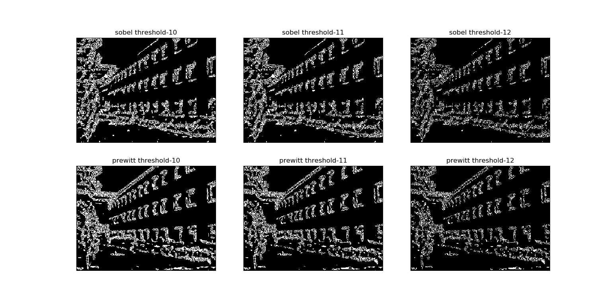

## Overview
This PA include two task:
- The first is to implement convolution operation under different types of kernels and compare their outputs.
- The second is to implement edge detection algorithm based on `Sobel` and `Prewitt` operators.

For the first task, I wrote the code to generate different size of Gaussian kernels and Average kernels, which are some basic smoothing kernels using in image de-blurring.
And I used the `cv2.filter2D()` to complete the convolution operation.

For the second task, I implemented the edge detection algorithm as per following steps:
```python
        0. generate the operator
	1. noise removing (using gaussian smoothing)
	2. compute horizontal and vertical gradients
	3. magnitude the gradients
	4. apply a threshold
```

And I got my best result under the following parameters:
 gaussian size--(11 x 11), threshold--11, operator--Prewitt, here is my result:
 
 
 You can modify the configuration in `line 133` of `PA1.py` and feed in you own input.
 
## Usage
```python
python PA1.py
```