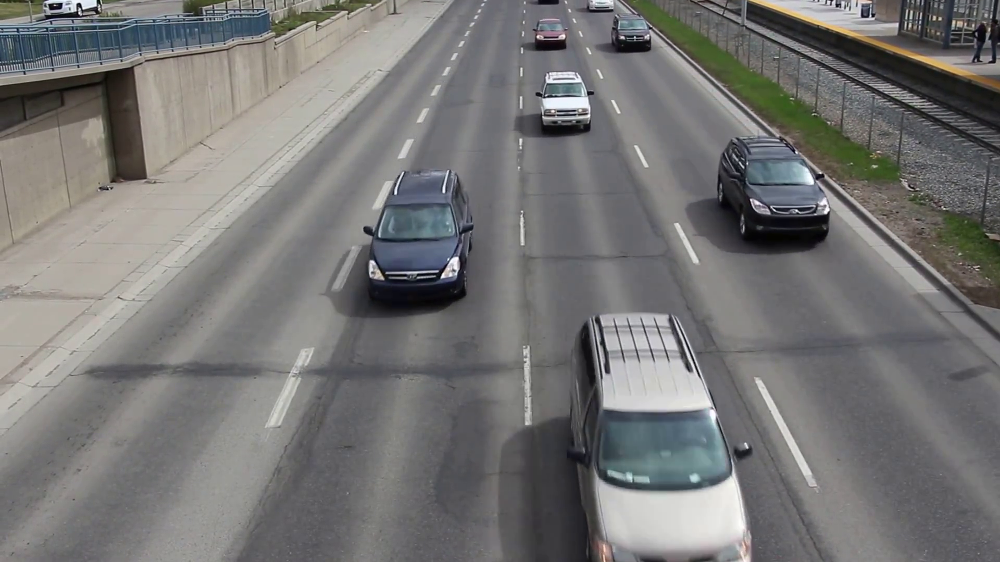
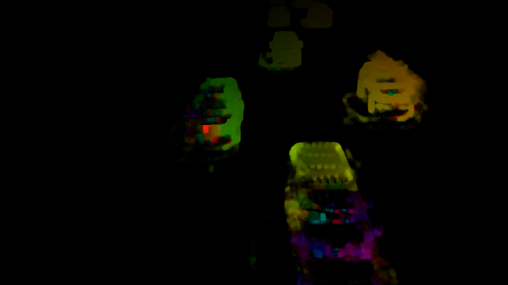

## Overview
Here includes some of my experiments and implementation of some technics from lecture 8 , they are:

- :heavy_check_mark: optical flow in OpenCV.(DO NOT USE THE `visualize_optical_flow` in `optical-flow.py`)


## Usage 

- optical flow

modify the video file or just feed in nothing to use your camera, and run:
```
$ python optical-flow.py
```

## My Result
- Result of Optical-Flow

Input: `/video/car_moving.mp4 `

Output:

 


 
